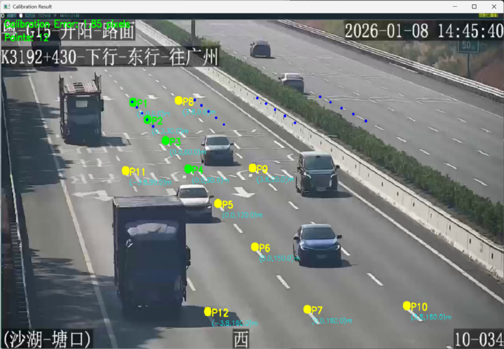

# 监控场景下的车速识别


## 1. 项目概述

本项目实现了一个基于单目视觉的车辆速度检测系统，专为高速公路和城市道路监控场景设计。

*   **相机标定：**使用单应性变换将像素坐标转换为真实世界坐标，消除相机透视畸变
*   **车辆检测**：使用YOLOv11l实时检测视频中的车辆
*   **车辆追踪**：实现多目标追踪算法，为每辆车分配固定ID并追踪轨迹
*   **速度计算**：加权结合多帧线性回归和两帧差分算法，准确计算车辆实时速度
*   **卡尔曼滤波**：使用卡尔曼滤波器平滑车辆位置和速度，提高测量稳定性


**主要特性：**

*   **高鲁棒性**：支持倾斜视角、部分遮挡等复杂场景
*   **实时性**

## 2. 目录结构说明

```
YOLO\_Speed\_Detection/task\_3/
├──  yolo\_speed\_prediction.py          	# 主程序代码
├──  YOLO\_Speed\_Detection.md\             
├──  calibration\_result.png               	# 标定结果图片
├──  points.png                             # 特征点图片
├──  Highway.json                           # Highway.mp4视频特征点标注文件
├──  Dataset/                               # 视频数据集
│   ├── Highway.mp4
└──  Output/                                # 输出目录

```
yolov111.pt模型请自行下载或复制

## 3. 环境配置与安装

### 本机实验环境

*   Python 3.10
*   CUDA 12.8

### 安装步骤

1.  **创建环境**：

    ```bash
    conda create -n yolo_speed_detection python==3.10 -y
    conda activate yolo_speed_detection
    ```
2.  **安装依赖**

    ```bash
    # 安装 PyTorch (根据你的 CUDA 版本调整)
    pip install torch torchvision torchaudio --index-url https://download.pytorch.org/whl/cu128

    # 安装项目依赖
    pip install opencv-python numpy ultralytics
    ```

## 4. 使用方法

直接运行yolo\_speed\_prediction.py，可以将其他监控视频添加到数据集Dataset。

推荐标记点：道路交通标线的白色虚线，高速公路是6-9线（线段长度6m，间隔9m），城市快速路是4-4线或4-6线（线段长度4m，间隔4m或6m）；车道宽度3.75m；人行道宽度4-6米（可以观察车辆大小估计人行道宽度）

输入视频文件路径、不加载已有的标定文件或者加载失败，验证标定选是或否都可以。

接下来会弹出标定窗口，选择容易判断实际距离的标记点，如下图，选择了虚线的起始点，因为6-9线的线段长度和间隔周期已知，就可以推算出实际距离。标定点最好能够覆盖图片不同距离的路面。标定好之后在界面中按“c”完成标定。


根据提示完成实际位置信息输入，结果如下图所示。终端里会询问每个点的实际X、Y坐标，可以以第一个点为(0, 0)点，沿着道路方向即为Y轴方向，纵向距离（正负无所谓）；与道路垂直的方向（如斑马线方向）即为X轴方向，横向距离（正负无所谓）。
纵向距离可以参考道路交通标线或者路标，如6-9线一个线段-间隔周期是15米（两个则是30米，即下图的情况）；横向距离可以参考车道宽度3.75米。实际坐标输入完成后会出现类似下面图片的结果。



若前面选择了验证标定，则请在画面中标出一条车道的宽度（比如两条平行虚线的起点，或者路口一条车道的两个角点），会判断标出的宽度是否与实际车道宽度一致。
若验证结果误差在良好范围内，则开始检测视频中的车速。

## 5. 输出说明

运行程序后，结果将保存在Output目录

## 6. 注意事项

*   确保视频路径正确
*   请自行下载yolov11l.pt模型，下载的权重名称是yolo11l.pt，记得改名
*   检测其他视频的车速时，请根据实际场景进行标定